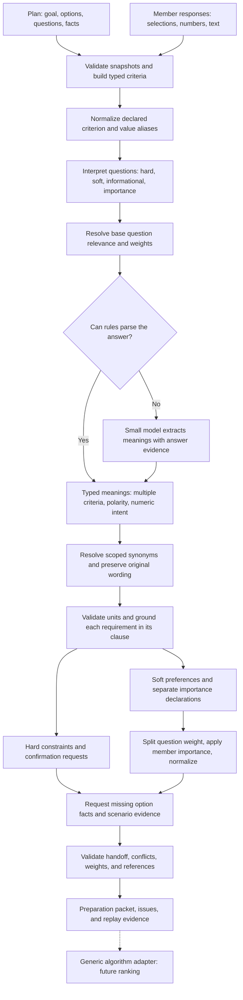

# Preprocessing flow

Preprocessing turns the plan and member answers into typed data and comparison
declarations. It does not calculate scores, rank options, or retrieve external
facts. The generic path now uses `sparse-v4`; the activity/time execution path
continues to use `activity-v2`.
Generic processing is versioned separately as `sparse-v11`; older model artifacts
must be regenerated before replay.



## Function

```python
from decision_service.preprocessing import preprocess

result = preprocess(
    planning_snapshot,
    response_snapshot,
    policy=None,
    semantic_provider=None,
    semantic_evidence=None,
)
```

Use `planning.options` for a generic decision. Use `planning.activities` for
an existing activity/time round. The service IDs identify immutable snapshots;
callers must supply matching round IDs and option revisions.
`policy.max_scenario_requests` limits date/duration scenario output (default
10,000) and is checked against saved evidence. Duration targets must be positive
whole days; the former 365-day ceiling is removed. Scenario ranges are clipped
to supplied shared availability before enumeration.

## Input

### Planning snapshot

| Field | Purpose |
| --- | --- |
| `round_id`, `option_revision`, `option_snapshot_id` | Identify the frozen plan |
| `decision_question` | The decision goal used for semantic classification |
| `roster` | Exact list of members whose responses are required |
| `options` | Names, or objects with option ID, title, description, and sourced facts |
| `questions` | Question IDs, ordinary labels, and optional choices/formats |
| `currency`, `cost_scope` | Required when asking for a monetary limit |
| `context` | Optional decision details; no required travel-specific fields |
| `criteria` | Optional `{attribute_id, value_type, unit}` declarations for dimensions whose option facts are missing |
| `canonicalization` | Optional criterion aliases and category/tag aliases scoped to a criterion |

A fact uses `{criterion, value, status, source, unit?, value_type?, context?}`.
Known types can be inferred from supplied scalar values or text-tag lists.
An explicit unknown fact needs a null value and declared type. Descriptions and
model-suggested tags do not become confirmed facts.

Questions do not require a `kind` or manual semantic binding on this path.
Supported form declarations are `text`, `choice`, `multi_choice`, `number`,
`boolean`, and `date_intervals`. Ordinary numeric/boolean values and declared
choice IDs are accepted in the answer envelope. A leader can override role,
criterion, relevance, weight, or mapping when needed.
Numeric questions can also declare `numeric_intent`: `target`, `minimum`,
`maximum`, `less_than`, `greater_than`, `maximize`, `minimize`, or `range`.
This declares the meaning of a bare numeric answer without changing hard/soft role.

### Response snapshot

```json
{
  "round_id": "product-1",
  "option_revision": "1",
  "response_snapshot_id": "product-responses-1",
  "participants": [{
    "participant_id": "p1",
    "response_status": "complete",
    "answers": [
      {"answer_id": "p1-budget", "question_id": "budget", "value": 1500},
      {"answer_id": "p1-battery", "question_id": "battery", "value": "12 hours"},
      {"answer_id": "p1-usage", "question_id": "usage", "value": ["Coding", "Design"]}
    ]
  }]
}
```

Answer IDs are preferred. When omitted, preprocessing generates a stable ID
from response snapshot, member, and question IDs. It rejects duplicate IDs and
unknown/repeated questions.

One answer can contain several meanings. Open text is extracted by the provider;
already structured meanings use this envelope directly:

```json
{
  "question_id": "preferences",
  "value": {
    "preferences": [
      {"criterion": "quiet", "value": true},
      {"criterion": "max_cost", "value": "$50", "intent": "less_than", "must_have": true},
      {"criterion": "step_free_access", "value": true, "must_have": true}
    ]
  }
}
```

Each meaning has its own criterion, type, unit, comparison, and provenance. These
member declarations do not assert anything about the options. Unknown criteria
produce typed fact requests. For compound dates, use a separate availability
question; the compound extractor does not resolve embedded date intervals.

See [planning_generic.json](../fixtures/preprocessing/planning_generic.json)
and [response_generic.json](../fixtures/preprocessing/response_generic.json)
for a complete example. All prices and specifications in these fixtures are
synthetic test data.

## Steps between input and output

1. **Validate snapshots and roster.** Check IDs, revisions, member status,
   duplicate records, supported formats, facts, currencies, and budget scope.
2. **Build the fact registry.** Identify each criterion's type and unit from
   supplied facts. Normalize categories/tags with case folding and whitespace
   normalization. Apply declared criterion/value aliases to facts while preserving
   their source and evidence status. Monetary amounts remain exact decimal strings in major units.
3. **Interpret questions.** Honor explicit leader definitions, then use supported
   rules for budget/date/duration wording and questions naming a supplied fact
   criterion. Ask the provider about unresolved meanings against the decision
   goal and supplied facts. Generic preference wording alone does not identify
   an attribute. Model classifications cannot make an ordinary target hard
   without explicit limit wording; hard/informational/importance relevance is derived as 0.
   Ambiguous or unfamiliar questions without a provider remain unclassified.
4. **Generate mappings.** Choose declarations from criterion type and question
   role in application code. The model does not declare mappings. For example:
   numeric target, numeric direction, acceptable range, tag overlap, categorical equality, or a
   maximum/minimum hard limit. Units must agree with the fact registry. A numeric
   target scale comes from confirmed option values, offered duration choices,
   or an explicit leader mapping. The model cannot invent a scale.
5. **Resolve question weights.** Use supplied leader weights or question
   relevance. Repeated automatic topics share relevance, and soft weights are
   normalized. Hard and informational questions have no scoring weight. Member
   answers are excluded from this stage. These weights describe question
   usefulness. Member importance is extracted separately below.
6. **Extract answers.** Parse exact dates, numbers/units, budget values including
   `2k`, choices, booleans, and explicit indifference locally when possible.
   A semantic provider extracts other text into grounded interpretations,
   preserving preferred versus avoided values and multiple criteria in one answer.
   Numeric meanings distinguish targets, higher/lower directions, intervals, and
   strict or inclusive bounds. A bare numeric quantity needs an explicit question
   intent, leader comparison mapping, or unambiguous target/limit wording;
   otherwise emit `AMBIGUOUS_NUMERIC_INTENT` and request clarification. The model
   cannot establish a target from an otherwise ambiguous quantity.
   Evidence must occur in the answer.
   Normalize equivalent criterion IDs and scoped text values with declared aliases
   first. An optional model equivalence assessment handles remaining labels against
   supplied criteria and observed/declared values. Ambiguous equivalence requests
   clarification; clear new meanings remain distinct.
   A hard interpretation needs requirement wording in its own clause; an unrelated
   clause cannot turn a preference into a requirement. Vague dates without a
   stated year request clarification before any model date extraction.
   Clear comparative preference clauses and label-only answers to a bound soft
   question cannot be promoted to hard merely because the model says must-have.
   A conservative English comparative grammar can repair numeric direction from
   the same evidence clause after the model has selected a typed criterion.
   Explicit hard questions and requirement wording still need a concrete limit.
   Single-token category answers use scoped label resolution directly, avoiding
   a separate model extraction that could invent requirement strength. Full
   clauses still use extraction.
7. **Compile typed answers.** Emit preferences and hard constraints with rule,
   unit, source question/answer IDs, evidence, and resolution status. A model
   interpretation of a hard requirement or available date range needs typed
   confirmation. Individual evidence excerpts are preserved; merged tag meanings
   carry `evidence_excerpts` when several excerpts support the record. An optional
   unanswered scoring question stays unresolved.
8. **Resolve member weights.** Split a soft question's weight equally across its
   distinct criteria. Apply explicit member importance multipliers, or ordinal
   tiers derived from grounded comparisons. Normalize separately for each member.
   Hard constraints have no scoring weight; soft preferences collected under a
   soft question retain its share. Conflicting comparisons, cycles,
   unknown/inactive criteria, and all-zero importance need clarification.
9. **Describe missing information.** Request facts by option, criterion, type,
   unit, source question, and priority. For date/duration decisions, form scenario
   requests and request costs with the relevant dates, duration, and budget scope.
10. **Validate the preparation.** Check declarations, references, units,
   normalized answers, and conflicts within each member/criterion. Required and
   excluded tags must not overlap after canonicalization. Numeric requirements
   are intersected with exact decimal comparisons: differing upper limits are
   compatible, while reversed bounds or touching open endpoints are not.
   Preserve each question's requirement and provenance; multiple numeric hard
   meanings in one question compile to their intersected interval. Impossible
   confirmed requirements retain their records with `status: needs_clarification`
   and actionable `CONFLICTING_ANSWER` issues, rather than invalidating the snapshot.
   Cross-member feasibility remains an execution responsibility.
   Return the typed packet plus actionable
   issues and frozen model evidence for replay.

The semantic provider is optional. Arbitrary wording still needs a configured
provider or saved evidence when rules cannot interpret it. Unit conversion,
external fact collection, and approximate similarity scoring are not implemented.
Scoped synonym normalization is supported; related concepts are not automatically
treated as equivalent.
Unsupported numeric negative constraints require
clarification rather than being converted to an incorrect limit.

The [evaluation runner](EVALUATION.md) now measures labelled development cases
using rules, a configured provider, or saved evidence. A live development run is
recorded in the evaluation documentation; accuracy on unseen inputs is unmeasured.

## Output

The generic result separates preprocessing completion from algorithm support:

```json
{
  "status": "provisional",
  "algorithm_input": null,
  "preparation": {
    "status": "ready",
    "context": {"schema_version": "sparse-v4"},
    "criteria": [],
    "candidates": [],
    "participants": [],
    "constraints": [],
    "preferences": [],
    "importance": [],
    "canonicalization": {"policy_version": "scoped-labels-v1", "declarations": {}, "records": []},
    "scoring_model": {},
    "fact_requests": [],
    "scenario_requests": []
  },
  "issues": [{"code": "EXECUTION_ADAPTER_REQUIRED"}],
  "semantic_evidence": null
}
```

This sketch omits field details. The complete frozen packet is
[expected_generic_preparation.json](../fixtures/preprocessing/expected_generic_preparation.json).

`preparation.status` means:

| Status | Meaning |
| --- | --- |
| `ready` | Active criteria, member answers, and required evidence are prepared |
| `needs_information` | Option facts, mappings, semantic provider, or context are missing |
| `needs_clarification` | Member answers or interpreted hard values need attention |

The outer `status` remains `provisional` for generic decisions, or
`needs_clarification` when member review is needed. Malformed inputs produce
`invalid_input`; a configured provider failure produces `upstream_unavailable`.
The existing algorithm handles activity/time input and cannot execute this
schema yet, so `algorithm_input` is null even when preparation is ready.

For the product fixture, the output includes:

- A confirmed `max_cost <= "1500"` constraint in USD major units.
- A battery-life target of `12` hours, with `numeric_target_v1` and scale `3`.
- Preferred usage tags `["coding", "design"]` with `tag_overlap_v1`.
- Battery and usage question weights of `0.5` each.
- No required dates, duration, or scenario requests.

A normalized preference has this shape:

```json
{
  "participant_id": "p1",
  "source_question_id": "battery",
  "source_answer_id": "p1-battery",
  "source_type": "member_response",
  "evidence": "12 hours",
  "kind": "attribute_preference",
  "attribute_id": "battery_life",
  "value_type": "number",
  "numeric_intent": "target",
  "intent_source": "question",
  "preferred_value": 12,
  "unit": "hours",
  "scope": "all",
  "polarity": "prefer",
  "utility_rule": "numeric_target_v1",
  "utility_parameters": {"scale": 3},
  "status": "confirmed"
}
```

A model-derived hard answer carries `confirmation_status: needs_confirmation`.
After review, the response can include:

```json
{
  "confirmed_requirement": {
    "attribute_id": "usage_tags",
    "required_value": ["coding"],
    "constraint_rule": "contains_all_v1",
    "unit": null
  }
}
```

It must match the actual interpreted value, rule, and unit. Confirmed constraints
are kept separate from soft preferences. The packet and semantic evidence contain
private member data; public recommendation responses should expose aggregate
explanations instead.

Use `confirmed_requirements: [...]` with the same four fields for each requirement
when an answer contains several model-derived hard meanings. The singular field
remains accepted.

## Numeric intent and member importance

| Member meaning | Output |
| --- | --- |
| `12 hours`, with no declared intent | `AMBIGUOUS_NUMERIC_INTENT`; no usable preference |
| `ideally 12 hours`, or `12 hours` under a target question | Target `12`, `numeric_target_v1`, declared scale |
| `longer is better` | Null target, `direction: maximize`, `numeric_maximize_v1` |
| `cheaper is better` | Null target, `direction: minimize`, `numeric_minimize_v1` |
| `between 10 and 14 hours` | Endpoints and inclusivity flags, `numeric_range_v1` |
| `under $50` | Strict upper endpoint for a soft range; `less_than_v1` for a hard limit |
| `at least 12 hours` | Inclusive lower endpoint; `minimum_v1` for a hard limit |

Direction parameters use the minimum and maximum confirmed option facts. Missing
facts leave the domain unresolved; a constant confirmed domain is valid. Ranges
preserve inclusive/exclusive endpoints and reject reversed or empty intervals.
No utility scores are calculated during preprocessing.

For example, a form can explicitly ask for a soft minimum:

```json
{
  "question_id": "battery",
  "label": "Preferred minimum battery life?",
  "role": "soft",
  "criterion": "battery_life",
  "relevance": 1,
  "numeric_intent": "minimum"
}
```

Answering `12 hours` produces a soft range with lower endpoint 12, not an exact
target. Setting `role: hard` and `relevance: 0` instead produces `minimum_v1`.
Explicit answer wording or a structured meaning's `intent` can override a
question default. The product fixture explicitly declares `numeric_intent: target`.
Numeric answer records expose `numeric_intent` and `intent_source` (`answer`,
`question`, `semantic_model`, or `combined_requirements`); questions expose
`numeric_intent_source`. Intersected model requirements still need confirmation
of the emitted interval, rule, and unit.

Explicit numeric importance is a relative multiplier, supplied either in
`participants[].importance` or an importance question's answer:

```json
{"battery_life": 3, "colour": 1}
```

The natural comparison “Battery life matters more than colour” produces an
ordering, not a numeric ratio. `longest_path_tiers_v1` assigns the lowest tier
1 and each higher criterion one plus the maximum tier below it. A two-criterion
ordering therefore uses multipliers 2 and 1 **as an application policy**. It does
not claim the member literally values one twice as much. Unmentioned criteria
default to 1; explicit numeric values must agree with any ordering.

For each member and distinct question/criterion pair:

```text
base_weight = question_weight / number_of_distinct_soft_criteria_in_that_answer
raw_weight = base_weight * importance_multiplier
effective_weight = raw_weight / sum_that_member_raw_weights
```

`scoring_model.member_weights` carries these values and resolution status. For
equal question weights and explicit multipliers 3 and 1, effective weights are
0.75 and 0.25. Another member can have the opposite weights while the shared
question relevance stays unchanged. Unresolved member weights have a null
`effective_weight` and must not be used for ranking.

## Criterion and tag canonicalization

Canonicalization gives equivalent labels one representation. It applies to
question criteria, member meanings, importance references, and declared aliases
on option facts. There is no global country or activity synonym dictionary.

Optional aliases are supplied in the planning snapshot:

```json
{
  "canonicalization": {
    "criteria": {
      "battery_life": ["runtime", "battery duration"],
      "usage_tags": ["work interests"]
    },
    "values": {
      "usage_tags": {
        "coding": ["programming", "software development"]
      }
    }
  }
}
```

Each criterion target must already exist in option facts or `planning.criteria`.
Value aliases support category and tag-set criteria only. The same label may
mean something different in another criterion. Alias collisions, chains, type
or unit mismatches, and facts that duplicate a criterion after mapping are
rejected. Case, spacing, Unicode width, and word separators are normalized;
significant symbols remain distinct (`C`, `C#`, and `C++`).

The optional small model implements `canonicalize_sparse_label` for undeclared
synonyms. It receives one label and allowed targets, not an instruction to
invent option facts. Its decisions are:

| Decision | Processing behavior |
| --- | --- |
| `equivalent` | Reuse one supplied target; record the model mapping as an interpretation |
| `distinct` | Preserve the new meaning without merging it |
| `unresolved` | Emit `AMBIGUOUS_CANONICAL_LABEL` and leave that meaning unusable for scoring |

Model-mapped preferences retain `source_type: semantic_model`; hard values still
need typed confirmation. Unknown numeric targets or tags cannot be invented by
an equivalence response. Option fact values use formatting and declared aliases
only, so a model assessment cannot rewrite a supplied fact. When no model is
configured, undeclared labels keep their literal meaning; synonym coverage is
limited to the declared aliases.

Declared form choices are registered as established labels before answers are
processed. Selecting one choice cannot trigger a model remap to another choice.
The schema checks target membership and response structure; it cannot prove that
an LLM's synonym judgment is correct. Earlier live development runs missed an
undeclared programming/coding synonym; the final run resolved it. Reviewed aliases make that mapping
deterministic; general synonym accuracy still needs independent evaluation.
The `scoped-labels-v3` prompt assesses each target independently in the supplied
criterion's practical context. An incoherent non-equivalent decision carrying
a suggested target requests clarification; it never authorizes a merge.

`preparation.canonicalization.records` preserves original and canonical labels,
input path, criterion scope, mapping source, and status. Original answers also
remain in provenance. Model assessments are cached by label, targets, criterion,
and policy, and saved in `semantic_evidence.canonical_assessments`. Replay makes
no model calls and rejects missing assessments, changed alias declarations, and
old processing versions.

Run the complete alias example without a model:

```sh
python3 -m decision_service.preprocessing \
  --planning decision_service/fixtures/preprocessing/planning_canonical.json \
  --responses decision_service/fixtures/preprocessing/response_canonical.json
```

### Fact gathering and the LLM

External fact gathering is not implemented. The current model can suggest
qualitative tags worth investigating for missing soft criteria. These appear as
`tag_suggestions` with `status: hypothesis`; they do not satisfy `fact_requests`.
Canonicalizing a member's preference also does not establish an option fact.
The [fact collection proposal](FACT_COLLECTION_PROPOSAL.md) describes source
options and a separate collector feeding frozen planning snapshots. It is a
research/design document; no collector was added to preprocessing.

A future collector should retrieve evidence from a source/API and attach the
source, context, and evidence status. An LLM could help select a relevant source
or extract a typed claim from retrieved text. Its own memory or suggested tags
would remain unverified evidence. Prices need currency, scope, and applicable
dates/duration; hard checks still require confirmed facts.

## Responsibility of the generic algorithm

Your teammate needs to implement the declarations in this packet:

- `attribute_match_v1`: scalar equality.
- `tag_overlap_v1`: fraction of desired tags supported by option tags.
- `numeric_target_v1`: `max(0, 1 - abs(actual - target) / scale)`.
- `numeric_maximize_v1`: `(actual - lower_bound) / (upper_bound - lower_bound)`, clipped to 0–1.
- `numeric_minimize_v1`: invert the maximize utility. A constant domain returns 0.5 for either direction.
- `numeric_range_v1`: 1 inside the declared interval, 0 outside; respect open endpoints and unbounded sides.
- `neutral_v1`: explicit indifference, utility `0.5`.
- `maximum_v1`, `minimum_v1`, `equals_v1`, `not_equals_v1`,
  `contains_all_v1`, `excludes_all_v1`, and `date_overlap_v1`: hard checks.
- `less_than_v1`, `greater_than_v1`, and `within_range_v1`: strict bounds and interval membership checks.

For soft `polarity: avoid`, invert the base match utility. Several preferences
for the same question/criterion pair are averaged before applying that pair's
member `effective_weight`. Distinct criteria already share the question mass in
`member_weights`; do not apply the question weight a second time. Use each
preference's utility rule and parameters, since one question can contain several
types and directions. A date
check requires the candidate date interval to fit the member's available
intervals; it must not accept a candidate merely because the intervals touch.
Unknown facts do not prove hard feasibility. The declared group objective and
missing-value policy remain part of the handoff. These are proposed generic
comparison semantics, not implementations in the current activity algorithm.
Execution must gate on `preparation.status: ready` and use only confirmed hard
records. `confirmation_status: confirmed` alone is insufficient when a record's
`status` is `needs_clarification` because its requirements contradict one another.

## Run and verify

From `FSD`:

```sh
python3 -m decision_service.preprocessing \
  --planning decision_service/fixtures/preprocessing/planning_generic.json \
  --responses decision_service/fixtures/preprocessing/response_generic.json

python3 -m unittest discover -s decision_service/tests -v
```

Implementation responsibilities are split across `generic_mapping.py` (types and
mappings), `generic_answers.py` and `generic_interpretations.py` (extraction and
per-criterion normalization), `generic_values.py` (numeric intent),
`member_importance.py` (importance and effective weights),
`generic_preparation.py` (compilation), `generic_validation.py` (handoff validation),
`canonicalization.py` (scoped labels and frozen equivalence assessments),
and `sparse.py` (snapshots and scenario orchestration). Provider
transport tests are mocked; the suite does not measure live extraction accuracy.
Use `python3 -m decision_service.evaluation` for the cross-domain labelled report.
See [HARDCODING_AUDIT.md](HARDCODING_AUDIT.md) for fixed language rules, reserved
concepts, product limits, policy defaults, and the older activity path's domain
assumptions.
